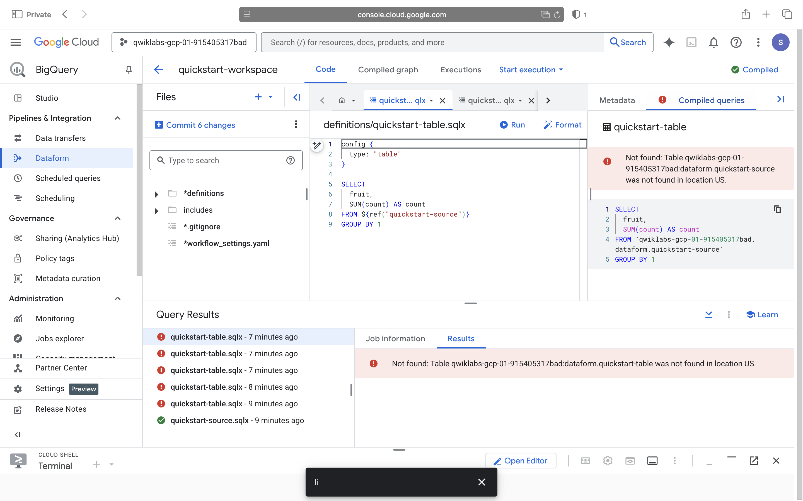

# YouTube Trending Data Pipeline 

A simple **ETL (Extract, Transform, Load) pipeline** project that fetches trending YouTube videos using the **YouTube Data API v3**, processes the data with **Pandas**, and stores it into a **SQLite database** for analysis.

---

##  Features
- Extract trending YouTube videos (title, channel, views, likes, comments).  
- Transform raw API response into a clean tabular format.  
- Load the processed data into a SQLite database.  
- Organized project structure for ETL pipelines.  

---

##  Project Structure
- `config.py`           # Stores API key  
- `extract.py`          # Extracts trending YouTube data  
- `load_to_db.py`       # Loads data into SQLite DB  
- `youtube_pipeline.py` # Runs full ETL pipeline  
- `data/`               # CSV output folder  
- `youtube_trending.db` # SQLite database (generated after running pipeline)  
- `requirements.txt`    # Python dependencies  
- `README.md`           # Project documentation  

---

##  Setup & Installation

1. Clone the repository:  
   ```bash
   git clone https://github.com/navyavenkata30-dot/youtube-data-pipeline.git
   cd youtube-data-pipeline
2. Create and activate a virtual environment:  
   ```bash
   python3 -m venv venv
   source venv/bin/activate   # Mac/Linux
   venv\Scripts\activate      # Windows

##  API Key Setup
1. Go to [Google Cloud Console](https://console.cloud.google.com/).  
2. Enable the **YouTube Data API v3**.  
3. Generate an API Key.  
4. Create a `config.py` file in the project root with the following content:
   ```python
   API_KEY = "YOUR_API_KEY"
## screen shot


